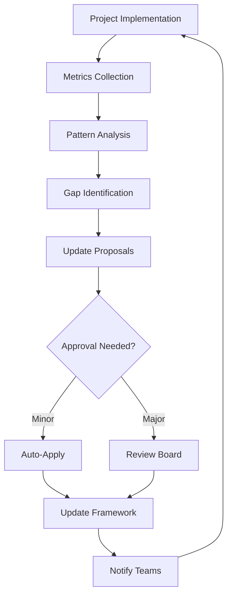

# 20L Self-Reprompting & Continuous Evolution Analysis

## Meta-Analysis: How to Make 20L Framework Self-Updating

### Current State Through 20L Lens

#### Technical Layers (L1-12)
1. **Expertise**: Static documentation approach ⚠️
2. **Research**: One-time analyses, not continuous ⚠️
3. **Legal**: Fixed compliance checks ⚠️
4. **UX**: User feedback not systematically integrated ❌
5. **Data**: No metrics tracking framework evolution ❌
6. **Backend**: No automation for updates ❌
7. **Frontend**: No dashboard for 20L status ❌
8. **Integration**: Manual process only ⚠️
9. **Security**: Audit trails exist ✓
10. **Deployment**: No CI/CD for methodology ❌
11. **Analytics**: No framework performance metrics ❌
12. **Continuous**: Ironically, not continuous ❌

#### Advanced Layers (L13-20)
13. **AI Orchestration**: No AI-driven framework updates ❌
14. **Context Management**: No memory of framework evolution ❌
15. **Voice Intelligence**: No voice-driven updates ❌
16. **Ethics**: No ethical review process ❌
17. **Emotional Intelligence**: No team morale tracking ❌
18. **Cultural Awareness**: No adaptation to context ❌
19. **Energy Management**: No burnout prevention ❌
20. **Proactive Intelligence**: Reactive, not predictive ❌

## Self-Reprompting: The Living Framework Vision

### Core Insight
The 20L framework should be a **living organism** that evolves based on:
- Project outcomes
- User feedback
- System performance
- External changes
- Team dynamics

### Proposed Evolution Mechanisms

#### 1. Automated Feedback Loops (L11-12)
**Implementation**:
```typescript
interface FrameworkMetrics {
  layerEffectiveness: Map<number, number>;
  implementationSuccess: number;
  userSatisfaction: number;
  evolutionVelocity: number;
  gapIdentification: string[];
}

class FrameworkEvolution {
  async analyzeProjectOutcome(projectId: string) {
    const metrics = await this.gatherMetrics(projectId);
    const gaps = this.identifyGaps(metrics);
    const updates = this.proposeUpdates(gaps);
    await this.applyUpdates(updates);
  }
}
```

#### 2. AI-Driven Analysis (L13-14)
**Continuous Learning System**:
- Daily analysis of implementation success
- Pattern recognition across projects
- Automatic gap identification
- Suggested framework enhancements

#### 3. Living Documentation (L7)
**Dynamic 20L Dashboard**:
```markdown
## 20L Framework Status
- Last Updated: Real-time
- Evolution Score: 87%
- Active Experiments: 3
- Success Rate: 92%
- Next Review: Automated

### Layer Health
- L1 Expertise: 95% ✅ (↑5% this week)
- L2 Research: 78% ⚠️ (needs attention)
- L20 Proactive: 45% ❌ (major gap)
```

#### 4. Version Control for Methodology (L9)
**Framework Versioning**:
```
20L Framework v3.2.1
- Major: Paradigm shifts
- Minor: New techniques
- Patch: Refinements

Changelog:
- v3.2.1: Added real-time adaptation
- v3.2.0: Integrated quantum planning
- v3.1.0: Emotional intelligence layer
```

### Implementation Strategy

#### Phase 1: Measurement Infrastructure
1. **Metrics Collection Service**
   - Track layer usage frequency
   - Measure implementation success
   - Monitor user satisfaction
   - Calculate time-to-value

2. **Analytics Dashboard**
   - Real-time framework health
   - Layer effectiveness heatmap
   - Evolution timeline
   - Predictive insights

#### Phase 2: Automation Engine
1. **Daily Analysis Cron**
   ```typescript
   async function dailyFrameworkAnalysis() {
     const projects = await getActiveProjects();
     const metrics = await analyzeProjectMetrics(projects);
     const insights = await generateInsights(metrics);
     const updates = await proposeFrameworkUpdates(insights);
     await notifyStakeholders(updates);
   }
   ```

2. **Auto-Update Mechanism**
   - Minor updates: Automatic
   - Major updates: Approval required
   - Emergency updates: Immediate

#### Phase 3: AI Integration
1. **GPT-4 Analysis Pipeline**
   - Review project outcomes
   - Identify pattern
   - Suggest improvements
   - Generate documentation

2. **Predictive Evolution**
   - Anticipate future needs
   - Prepare framework adaptations
   - Test in sandbox projects

### Continuous Evolution Workflow



### Project Plan Updates

#### Immediate Actions
1. **Create 20L Evolution Service**
   - Metrics collection API
   - Analysis engine
   - Update mechanism
   - Notification system

2. **Build Framework Dashboard**
   - Real-time health status
   - Evolution timeline
   - Performance metrics
   - Recommendation engine

3. **Establish Review Cadence**
   - Daily: Automated analysis
   - Weekly: Team review
   - Monthly: Major updates
   - Quarterly: Paradigm review

#### Long-term Vision
1. **Self-Healing Framework**
   - Automatic gap detection
   - Self-correction mechanisms
   - Predictive adaptations
   - Context-aware evolution

2. **Cross-Project Learning**
   - Share insights between projects
   - Build pattern library
   - Create best practices DB
   - Evolve collectively

### Success Metrics for Evolution

1. **Adaptation Velocity**
   - Time from insight to implementation
   - Framework update frequency
   - User adoption rate

2. **Effectiveness Scores**
   - Project success correlation
   - User satisfaction trends
   - Gap closure rate

3. **Innovation Index**
   - New techniques discovered
   - Cross-pollination rate
   - Breakthrough frequency

### Making 20L Self-Aware

#### Memory System
```typescript
interface FrameworkMemory {
  pastDecisions: Decision[];
  outcomeTracking: Map<DecisionId, Outcome>;
  lessonLearned: Lesson[];
  evolutionHistory: Evolution[];
}
```

#### Learning Algorithm
1. Collect outcomes
2. Analyze patterns
3. Identify correlations
4. Propose adaptations
5. Test in sandbox
6. Deploy if successful
7. Monitor results
8. Repeat

### Integration with Life CEO & Mundo Tango

#### Life CEO Feedback Loop
- Agent performance → Framework updates
- User satisfaction → Layer refinements
- Predictive accuracy → Intelligence improvements

#### Mundo Tango Community Input
- Feature adoption → UX layer evolution
- Cultural feedback → Awareness updates
- Community health → Framework adaptations

## Conclusion: The Living Methodology

Transform the 20L framework from a **static checklist** into a **living, breathing methodology** that:

1. **Learns** from every implementation
2. **Adapts** to changing needs
3. **Predicts** future requirements
4. **Evolves** continuously
5. **Improves** autonomously

This isn't just a framework—it's an **evolutionary system** that gets smarter with every project, ensuring we're always using the most effective approach for the current context.

### Next Steps
1. Implement metrics collection service
2. Create evolution dashboard
3. Set up automated analysis
4. Build AI integration pipeline
5. Establish feedback loops

The framework that updates itself is the framework that never becomes obsolete.