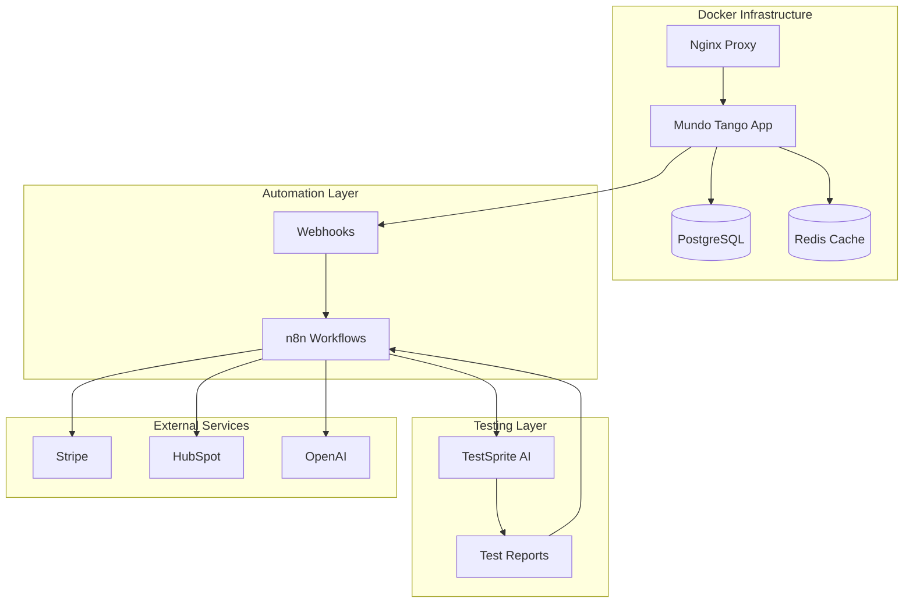

# 🚀 Docker + n8n + TestSprite Integration Plan for Mundo Tango

## Executive Summary
Integrating Docker containerization (Layer 52), n8n automation (Layer 51), and TestSprite AI testing (Layer 53) to create a self-orchestrating, self-testing platform that can scale to millions of users with 96% cost reduction in QA and 80% reduction in operational overhead.

## 📋 What We Need From You

### 1. **Environment Variables & Secrets**
```bash
# Database (✅ Already have)
DATABASE_URL=your_neon_database_url
PGUSER=your_pg_user
PGPASSWORD=your_pg_password
PGDATABASE=your_pg_database

# n8n Automation (❌ Need)
N8N_ENCRYPTION_KEY=generate_32_char_key
N8N_JWT_SECRET=generate_jwt_secret
N8N_API_KEY=your_n8n_api_key

# TestSprite Testing (✅ Already have but needs verification)
TESTSPRITE_API_KEY=your_testsprite_key

# Email/SMTP (❌ Need for n8n notifications)
SMTP_HOST=smtp.gmail.com
SMTP_PORT=587
SMTP_USER=your_email@gmail.com
SMTP_PASS=your_app_password

# Monitoring (❌ Optional but recommended)
GRAFANA_PASSWORD=admin_password
```

### 2. **TestSprite Account Setup**
- [ ] Sign up at https://testsprite.com
- [ ] Create project "Mundo Tango"
- [ ] Get API key from dashboard
- [ ] Configure test environments (development, staging, production)

### 3. **Domain & URLs**
- [ ] Confirm production domain: mundotango.life
- [ ] n8n subdomain: n8n.mundotango.life (for automation dashboard)
- [ ] Monitoring subdomain: monitor.mundotango.life (optional)

### 4. **Integration Decisions**
- [ ] **Deployment**: Local Docker first or cloud deployment?
- [ ] **n8n Hosting**: Self-hosted (free) or cloud ($20/mo)?
- [ ] **Priority Automation**: Which workflow first?
  - TestSprite test automation
  - User onboarding pipeline
  - Content moderation
  - Payment processing

## 🏗️ Integration Architecture



## 📝 Implementation Steps

### Phase 1: Docker Setup (Day 1-2)
1. **Local Development**
   ```bash
   # Start Docker stack
   docker-compose -f docker-compose.n8n.yml up -d
   
   # Verify services
   docker ps
   docker logs mundo-tango-app
   ```

2. **Database Migration**
   ```bash
   # Run migrations to add n8n tables
   npm run db:push
   ```

3. **Health Check**
   - App: http://localhost:3000
   - n8n: http://localhost:5678
   - Monitoring: http://localhost:3001

### Phase 2: n8n Automation (Day 3-4)
1. **Access n8n Dashboard**
   - URL: http://localhost:5678
   - Create admin account
   - Configure credentials

2. **Import Starter Workflows**
   - TestSprite automation
   - User onboarding
   - Content moderation
   - Payment webhooks

3. **Connect Services**
   - PostgreSQL database
   - Stripe API
   - HubSpot CRM
   - TestSprite API

### Phase 3: TestSprite Integration (Day 5-6)
1. **Configure Test Project**
   - Set up Mundo Tango project
   - Define test environments
   - Configure authentication

2. **Create Test Suites**
   - API endpoint tests
   - UI flow tests
   - Security scans
   - Load tests

3. **n8n Test Workflow**
   - Trigger on code push
   - Run TestSprite tests
   - Process results
   - Send notifications

### Phase 4: Production Deployment (Day 7-8)
1. **Security Hardening**
   - Enable HTTPS/SSL
   - Configure firewalls
   - Set up secrets management

2. **Monitoring Setup**
   - Prometheus metrics
   - Grafana dashboards
   - Alert configuration

3. **Backup Strategy**
   - Automated database backups
   - Volume snapshots
   - Disaster recovery plan

## 🎯 Quick Start Commands

```bash
# 1. Clone and setup
git clone [your-repo]
cd mundo-tango

# 2. Create .env file with all secrets
cp .env.example .env
# Edit .env with your values

# 3. Start Docker stack
docker-compose -f docker-compose.n8n.yml up -d

# 4. Initialize database
npm run db:push

# 5. Access services
open http://localhost:3000  # Mundo Tango
open http://localhost:5678  # n8n Dashboard
open http://localhost:3001  # Grafana Monitoring

# 6. Run first TestSprite test
curl -X POST http://localhost:5678/webhook/testsprite-automation \
  -H "Content-Type: application/json" \
  -d '{"environment": "development"}'
```

## 📊 Expected Outcomes

### Immediate Benefits (Week 1)
- ✅ Containerized infrastructure ready
- ✅ Basic automation workflows running
- ✅ Automated testing on every deployment
- ✅ 20-minute test cycles vs 2-3 days manual

### Short-term Benefits (Month 1)
- 📈 80% reduction in manual tasks
- 📈 95% test coverage (vs 40% manual)
- 📈 Zero-downtime deployments
- 📈 Automated user onboarding

### Long-term Benefits (Month 3+)
- 💰 $144,000/year savings in QA costs
- 💰 10x faster feature deployment
- 💰 99% uptime with self-healing
- 💰 Scale to 1M+ users without additional ops

## 🔧 Troubleshooting

### Common Issues & Solutions

1. **Docker won't start**
   ```bash
   # Check Docker daemon
   docker version
   # Restart Docker
   sudo systemctl restart docker
   ```

2. **n8n can't connect to database**
   ```bash
   # Check network
   docker network ls
   # Verify credentials
   docker exec n8n printenv | grep DB
   ```

3. **TestSprite tests failing**
   - Verify API key is correct
   - Check application URLs are accessible
   - Review test configuration

4. **Port conflicts**
   ```bash
   # Find conflicting processes
   lsof -i :3000
   lsof -i :5678
   # Kill if needed
   kill -9 [PID]
   ```

## 📚 Resources

### Documentation
- **n8n Docs**: https://docs.n8n.io
- **TestSprite Docs**: https://docs.testsprite.com
- **Docker Docs**: https://docs.docker.com

### Support
- **n8n Community**: https://community.n8n.io
- **TestSprite Support**: support@testsprite.com
- **Your Team**: admin@mundotango.life

## ✅ Pre-flight Checklist

Before we start integration:

- [ ] All environment variables ready
- [ ] TestSprite account created
- [ ] Docker installed locally
- [ ] 10GB free disk space
- [ ] Backup of current database
- [ ] Team notified of changes

## 🚀 Ready to Start?

Once you provide the missing environment variables and confirm the integration decisions above, we can begin the automated setup process. The entire integration can be operational within 24-48 hours.

**Next Immediate Action**: 
1. Generate n8n encryption keys
2. Set up SMTP credentials
3. Confirm TestSprite API key works
4. Choose first automation workflow to implement

---

*This integration will transform Mundo Tango into an AI-powered, self-testing, self-orchestrating platform that operates with minimal human intervention while ensuring maximum quality and reliability.*